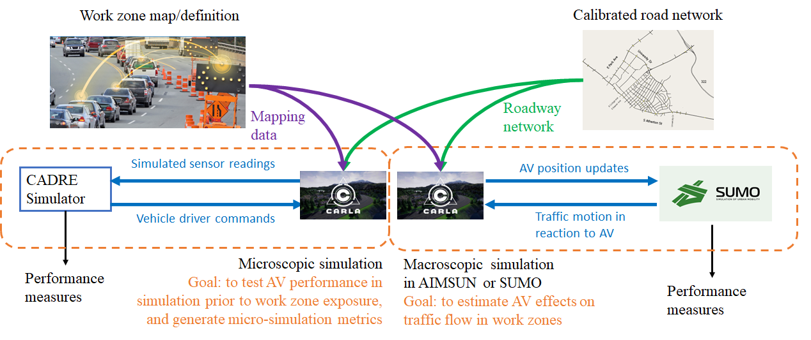

.. test documentation master file, created by
   sphinx-quickstart on Tue Dec 13 19:15:30 2022.
   You can adapt this file completely to your liking, but it should at least
   contain the root `toctree` directive.

Project activity by year
================================

Year 1
---------------------------------------------------------

Traffic and vehicle simulations
~~~~~~~~~~~~~~~~~~~~~~~~~~~~~~~~~~~

   
* `TrafficSimulators_GettingStartedWithDifferrentSimulators_GettingStartedWithCARLA`_: Launch page to get started with CARLA (IVSG - PSU internal)
* `TrafficSimulators_GettingStartedWithDifferrentSimulators_GettingStartedWithSUMO`_: Launch page to get started with SUMO (IVSG - PSU internal)
* `TrafficSimulators_GettingStartedWithDifferrentSimulators_GettingStartedWithCARLA-SUMOCosimulation`_: Launch page to get started with CARLA-SUMO cosimulation (IVSG - PSU internal)

Mapping
~~~~~~~~~~

About the Mapping Van: 
::::::::::::::::::::::::
* `Mapping_MappingVan_About`_: General information about the Penn State Mapping Van

Choice of Coordinate Systems for Wide Areas: 
::::::::::::::::::::::::::::::::::::::::::::::::
* `Mapping_CoordinateSystems_WideAreas`_: Discussion of coordinate systems and the errors each can introduce when mapping large areas (cloned from IVSG on 2023 04 03).

Hardware: 
~~~~~~~~~~~~~~~~~~~~~

Power System: 

* `Hardware_MappingVanHardware_PowerSystem`_: Setup of power system (IVSG - PSU internal)

Time Synchonization: 

* `FieldDataCollection_TypicalHardwareSetups_TriggerCameraUsingExternalSignal`_:Methods to externally trigger FLIR cameras to external trigger signals. (IVSG - PSU internal)
* `FieldDataCollection_TypicalHardwareSetups_TimeSync_ArduinoUsingGPSPPS`_: Producing tight time-trigger pulses (less than 20 microseconds jitter) via Arduinos. (IVSG - PSU internal)
* `FieldDataCollection_TypicalHardwareSetups_TimeSyncTriggerBox`_: CAD models for trigger box. (IVSG - PSU internal)

Sensors - Cameras: 

* `Hardware_MappingVanHardware_Camera`_: Remounting the cameras to improve regidity, water intrusion, and hardware faults. (IVSG - PSU internal)
* `Camera Calibration`_ : Methods used to calibrate the camera system. (IVSG - PSU internal)

Sensors - LIDAR: 

* `Hardware_MappingVanHardware_LiDAR`_: Documents of LiDAR specs. (IVSG - PSU internal)
* `FieldDataCollection_TypicalHardwareSetups_LIDARs_CeptonX90Install`_: Procedure of installing CeptonX90 LiDAR. (IVSG - PSU internal)
* `FieldDataCollection_TypicalHardwareSetups_LIDARs_VelodyneVLP16Install`_: Procedure of installing VelodyneVLP16 LiDAR. (IVSG - PSU internal)

Sensors - Wheel Encoders:

* `Hardware_MappingVanHardware_Encoder`_: Setup of encoders. (IVSG - PSU internal)

Sensors - Radar:

* `Hardware_MappingVanHardware_Radar`_: Setup of Radar. (IVSG - PSU internal) 

Sensors - GPS:

* `Hardware_MappingVanHardware_GPS`_: Setup of GPS. (IVSG - PSU internal)

Sensors - IMU:

* `Hardware_MappingVanHardware_IMU`_: Setup of IMU. (IVSG - PSU internal)

Sensors - Steering System:

* `Hardware_MappingVanHardware_SteeringSystem`_: Setup of steering system. (IVSG - PSU internal)    

Calibration:
~~~~~~~~~~~~~~~~~~~~
To be added:

Data Collection:
~~~~~~~~~~~~~~~~~~

To be added.

Data Processing: 
~~~~~~~~~~~~~~~~~

Processing GPS Data: 

* `DataProcessing_GPS_GPSConversionMethods`_: A repo sharing the algorithms used for GPS conversions, e.g. LLA to ENU (cloned from IVSG on 2023 04 03). 

Maps and scenarios: 
~~~~~~~~~~~~~~~~~~~~~~

* `FieldDataCollection_VisualizingFieldData_PlotWorkZone`_: A repo displaying the scenarios and their descriptions. (IVSG - PSU internal)

Data Parsing:
~~~~~~~~~~~~~~~~~~~~

* `FieldDataCollection_DataCollectionProcedures_ParseRawDataToDatabase`_: Parse raw data (.bag) to raw data database. (IVSG - PSU internal)
* `FieldDataCollection_DataCollectionProcedures_DataTransferWithDMS`_:Transfer data to PennDOT DMS. (IVSG - PSU internal)
* `FieldDataCollection_DataCollectionProcedures_AutomatingDataTransferToDMSUsingCommandLine`_: Transfer data to PennDOT DMS using command line tools. (IVSG - PSU internal)   
* `FieldDataCollection_DataCollectionProcedures_StitchingImagesToVideo`_:Stitching parsed images into a video. (IVSG - PSU internal)

Year 2
---------------------------------
Simulating construction scenarios:
~~~~~~~~~~~~~~~~~~~~~~~~~~~~~~~~~~
* `Simulating a traffic flow on Penn State test track`_: The work in this area involves information to guide how to simulate a traffic flow on Penn State test track. (IVSG - PSU internal)

* The following table shows the three roadway situations for the simulation: urban, artirial and highway, including the location we picked in State College and the corresponding data link.
.. csv-table:: 3 Situations Sumamry
   :file: tables/three_situations.csv
   :header-rows: 1
* The following table shows the summary about whether the considered three roadway situations could be applied to each of the proposed 20 scenarios. 
.. csv-table:: 20 Scenarios - 3 Situations Sumamry
   :file: tables/20scenarios.csv
   :header-rows: 1

Year 3
----------------------------------
To be added: 

* Conduct closed track testing
* Collect/Process/Upload/Analyze closed track test data

Year 4
------------------

To be added: 

* Set up work zone in live on-road
* Map work zone in live on-road
* Process/Upload map
* Conduct live on-road testing
* Collect/Process/Upload/Analyze live on-road testing data

.. _Simulating a traffic flow on Penn State test track: https://github.com/ivsg-psu/TrafficSimulators_GettingStartedWithDifferrentSimulators_GettingStartedWithSUMO/blob/main/Documents/Simulating%20test%20track%20in%20SUMO.pptx
.. _TrafficSimulators_GettingStartedWithDifferrentSimulators_GettingStartedWithCARLA-SUMOCosimulation: https://github.com/ivsg-psu/TrafficSimulators_GettingStartedWithDifferrentSimulators_GettingStartedWithCARLA-SUMOCosimulation
.. _TrafficSimulators_GettingStartedWithDifferrentSimulators_GettingStartedWithSUMO: https://github.com/ivsg-psu/TrafficSimulators_GettingStartedWithDifferrentSimulators_GettingStartedWithSUMO
.. _TrafficSimulators_GettingStartedWithDifferrentSimulators_GettingStartedWithCARLA: https://github.com/ivsg-psu/TrafficSimulators_GettingStartedWithDifferrentSimulators_GettingStartedWithCARLA
.. _Mapping_MappingVan_About: https://connectedvehicles.psu.edu/
.. _Mapping_CoordinateSystems_WideAreas: https://github.com/PAWorkzoneAutomation/TrafficSimulators_WideAreaCoordinateSystems
.. _DataProcessing_GPS_GPSConversionMethods: https://github.com/PAWorkzoneAutomation/FieldDataCollection_GPSRelatedCodes_GPSClass
.. _FieldDataCollection_DataCollectionProcedures_StitchingImagesToVideo: https://github.com/ivsg-psu/FieldDataCollection_DataCollectionProcedures_StitchingImagesToVideo
.. _FieldDataCollection_DataCollectionProcedures_AutomatingDataTransferToDMSUsingCommandLine: https://github.com/ivsg-psu/FieldDataCollection_DataCollectionProcedures_AutomatingDataTransferToDMSUsingCommandLine
.. _FieldDataCollection_DataCollectionProcedures_DataTransferWithDMS: https://github.com/ivsg-psu/FieldDataCollection_DataCollectionProcedures_DataTransferWithDMS
.. _FieldDataCollection_DataCollectionProcedures_ParseRawDataToDatabase: https://github.com/ivsg-psu/FieldDataCollection_DataCollectionProcedures_ParseRawDataToDatabase
.. _FieldDataCollection_TypicalHardwareSetups_TriggerCameraUsingExternalSignal: https://github.com/ivsg-psu/FieldDataCollection_TypicalHardwareSetups_TriggerCameraUsingExternalSignal
.. _FieldDataCollection_TypicalHardwareSetups_TimeSync_ArduinoUsingGPSPPS: https://github.com/ivsg-psu/FieldDataCollection_TypicalHardwareSetups_TimeSync_ArduinoUsingGPSPPS
.. _FieldDataCollection_TypicalHardwareSetups_TimeSyncTriggerBox: https://github.com/ivsg-psu/FieldDataCollection_TypicalHardwareSetups_TimeSyncTriggerBox
.. _Hardware_MappingVanHardware_Camera: https://github.com/ivsg-psu/FieldDataCollection_TypicalHardwareSetups_TriggerCameraUsingExternalSignal
.. _Camera Calibration: https://github.com/ivsg-psu/ivsg_master/tree/master/CameraCalibration_wiki
.. _Hardware_MappingVanHardware_LiDAR: https://github.com/ivsg-psu/Hardware_MappingVanHardware_LiDAR

.. _FieldDataCollection_TypicalHardwareSetups_LIDARs_VelodyneVLP16Install: https://github.com/ivsg-psu/FieldDataCollection_TypicalHardwareSetups_LIDARs_VelodyneVLP16Install
.. _Hardware_MappingVanHardware_Encoder: https://github.com/ivsg-psu/Hardware_MappingVanHardware_Encoder
.. _Hardware_MappingVanHardware_Radar: https://github.com/ivsg-psu/Hardware_MappingVanHardware_Radar
.. _Hardware_MappingVanHardware_PowerSystem: https://github.com/ivsg-psu/Hardware_MappingVanHardware_PowerSystem
.. _Hardware_MappingVanHardware_GPS: https://github.com/ivsg-psu/Hardware_MappingVanHardware_GPS
.. _Hardware_MappingVanHardware_IMU: https://github.com/ivsg-psu/Hardware_MappingVanHardware_IMU
.. _Hardware_MappingVanHardware_SteeringSystem: https://github.com/ivsg-psu/Hardware_MappingVanHardware_SteeringSystem

.. _FieldDataCollection_TypicalHardwareSetups_LIDARs_CeptonX90Install: https://github.com/ivsg-psu/FieldDataCollection_TypicalHardwareSetups_LIDARs_CeptonX90Install
.. _FieldDataCollection_VisualizingFieldData_PlotWorkZone: https://github.com/ivsg-psu/FieldDataCollection_VisualizingFieldData_PlotWorkZone