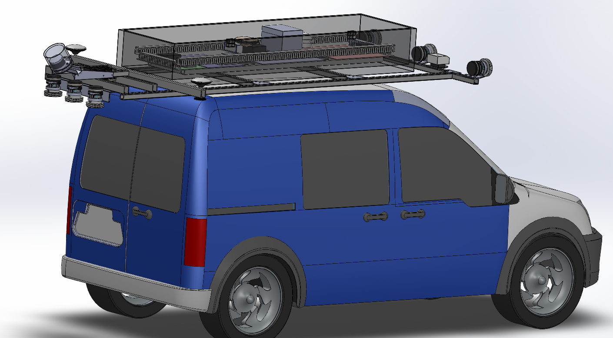
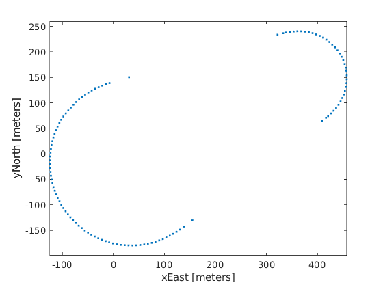

.. test documentation master file, created by
   sphinx-quickstart on Tue Dec 13 19:15:30 2022.
   You can adapt this file completely to your liking, but it should at least
   contain the root `toctree` directive.

Project activity by year
================================

Year 1
---------------------------------------------------------

Decide how to do traffic and vehicle simulations
~~~~~~~~~~~~~~~~~~~~~~~~~~~~~~~~~~~~~~~~~~~~~~~~~~~~

.. image:: Images/ADS_overview_diagram.png
   
* `TrafficSimulators_GettingStartedWithDifferrentSimulators_GettingStartedWithCARLA`_: Launch page to get started with CARLA (cloned from IVSG on 2023 06 05)

.. image:: Images/CARLA_day.png

* `TrafficSimulators_GettingStartedWithDifferrentSimulators_GettingStartedWithSUMO`_: Launch page to get started with SUMO (cloned from IVSG on 2023 06 05)

.. image:: Images/SUMODemo.png

* `TrafficSimulators_GettingStartedWithDifferrentSimulators_GettingStartedWithCARLA-SUMOCosimulation`_: Launch page to get started with CARLA-SUMO cosimulation (IVSG - PSU internal)

.. image:: Images/CoSim.png

Mapping
~~~~~~~~~~

About the Mapping Van
::::::::::::::::::::::::

* `Mapping_MappingVan_About`_: General information about the Penn State Mapping Van. Mapping van is shown below. 

.. image:: Images/MappingVanAtBeaver.png

Choice of Coordinate Systems for Wide Areas
::::::::::::::::::::::::::::::::::::::::::::::::

* `Mapping_CoordinateSystems_WideAreas`_: Discussion of coordinate systems and the errors each can introduce when mapping large areas (cloned from IVSG on 2023 04 03).The coordinate system conversions through simulation work are as below.

.. image:: Images/Coordinat_System_Conversion.png

Hardware installation
~~~~~~~~~~~~~~~~~~~~~

* `Hardware_MappingVanHardware_CADdrawings`_: The mapping van measurements used for the GPS antenna calibration. Sample CAD drawings are below. 

.. image:: Images/labelledSensorsCADDrawing.png

Power System

* `Hardware_MappingVanHardware_PowerSystem`_: Setup of power system (IVSG - PSU internal)

Time Synchonization

* `FieldDataCollection_TypicalHardwareSetups_TriggerCameraUsingExternalSignal`_:Methods to externally trigger FLIR cameras to external trigger signals. (IVSG - PSU internal)
* `FieldDataCollection_TypicalHardwareSetups_TimeSync_ArduinoUsingGPSPPS`_: Producing tight time-trigger pulses (less than 20 microseconds jitter) via Arduinos. (IVSG - PSU internal)
* `FieldDataCollection_TypicalHardwareSetups_TimeSyncTriggerBox`_: CAD models for trigger box. (IVSG - PSU internal)

Sensors - Cameras

* `Hardware_MappingVanHardware_Camera`_: Remounting the cameras to improve regidity, water intrusion, and hardware faults. (IVSG - PSU internal)
* `Camera Calibration`_ : Methods used to calibrate the camera system. (IVSG - PSU internal)

Sensors - LIDAR

* `Hardware_MappingVanHardware_LiDAR`_: Documents of LiDAR specs. (IVSG - PSU internal)
* `FieldDataCollection_TypicalHardwareSetups_LIDARs_CeptonX90Install`_: Procedure of installing CeptonX90 LiDAR. (IVSG - PSU internal)
* `FieldDataCollection_TypicalHardwareSetups_LIDARs_VelodyneVLP16Install`_: Procedure of installing VelodyneVLP16 LiDAR. (IVSG - PSU internal)

Sensors - Wheel Encoders

* `Hardware_MappingVanHardware_Encoder`_: Setup of encoders. (IVSG - PSU internal)

Sensors - Radar

* `Hardware_MappingVanHardware_Radar`_: Setup of Radar. (IVSG - PSU internal) 

Sensors - GPS

* `Hardware_MappingVanHardware_GPS`_: Setup of GPS. (IVSG - PSU internal)

Sensors - IMU

* `Hardware_MappingVanHardware_IMU`_: Setup of IMU. (IVSG - PSU internal)

Sensors - Steering System

* `Hardware_MappingVanHardware_SteeringSystem`_: Setup of steering system. (IVSG - PSU internal)    

Data Parsing
~~~~~~~~~~~~~~~~~~~~

* `FieldDataCollection_DataCollectionProcedures_ParseRawDataToDatabase`_: Parse raw data (.bag) to raw data database. (IVSG - PSU internal)
* `FieldDataCollection_DataCollectionProcedures_DataTransferWithDMS`_:Transfer data to PennDOT DMS. (IVSG - PSU internal)
* `FieldDataCollection_DataCollectionProcedures_AutomatingDataTransferToDMSUsingCommandLine`_: Transfer data to PennDOT DMS using command line tools. (IVSG - PSU internal)   
* `FieldDataCollection_DataCollectionProcedures_StitchingImagesToVideo`_:Stitching parsed images into a video. (IVSG - PSU internal)

Year 2
---------------------------------

The data flow of the simulation is below 

.. image:: Images/PennDOT_Simulation_Workflow_V2.drawio.png

For zoomed-in view, please see: https://github.com/PAWorkzoneAutomation/PAWorkzoneAutomation.github.io/blob/main/Images/PennDOT_Simulation_Workflow_V2.drawio.png

Simulating construction scenarios
~~~~~~~~~~~~~~~~~~~~~~~~~~~~~~~~~~
* `Simulating a traffic flow on Penn State test track`_: The work in this area involves information to guide how to simulate a traffic flow on Penn State test track. (IVSG - PSU internal)

.. image:: Images/simulateFlowOnTrack.png

* The following tables show the three roadway situations for the simulation: urban, artirial and highway, including the location we picked in State College and the corresponding data link.

.. csv-table:: Situation 1 Summary
   :file: tables/situations1.csv
   :header-rows: 1

.. csv-table:: Situation 2 Summary
   :file: tables/situations2.csv
   :header-rows: 1

.. csv-table:: Situation 3 Summary
   :file: tables/situations3.csv
   :header-rows: 1

* The following table shows the summary about whether the considered three roadway situations could be applied to each of the proposed 20 scenarios. 

.. csv-table:: 20 Scenarios - 3 Situations Sumamry
   :file: tables/20scenarios.csv
   :header-rows: 1

Simulation post processing
~~~~~~~~~~~~~~~~~~~~~~~~~~~~~~~~
* `FeatureExtraction_Association_PointToPointAssociation`_: Functions are provided to determine matches between data sets of (X,Y) points, store and compare groups of associated points (patch objects), and determine intersections between patch objects and circular arcs (useful for collision detection).

.. image:: Images/fcn_Points_fillPointSampleSets_Ex3.jpg

* `FeatureExtraction_SafetyMetrics_SafetyMetricsClass`_: MATLAB code implementation of functions that perform safety metric calculations given a set of objects and a path through them.

.. figure:: Images/TTC.png
   :align: center

   Time to collision

.. figure:: Images/lanechange.gif
   :align: center

   Demo of vehicle doing a lane change

Automatic generation of work zone simulation scenarios
~~~~~~~~~~~~~~~~~~~~~~~~~~~~~~~~~~~~~~~~~~~~~~~~~~~~~~~~~~

**The automatic generation of scenarios for simulation that follow the workflow as below:**

.. figure:: Images/Presentations/AutomaticGenerationOfWorkZoneSimulationScenarios/AutomaticGenerationOfScenarios.drawio.png
   :align: center

The source file of this workflow diagram can be found here: https://drive.google.com/file/d/18G0Bb3WNbk9Mf6DgM548p8j4xtOKnf1m/view?usp=sharing

**Scenarios defined in KMZ format are loaded into GIS software, such as Google Earth.**

.. figure:: Images/Presentations/AutomaticGenerationOfWorkZoneSimulationScenarios/googleEarth.png
   :align: center

   This contains all data for the CAD definition, but most of this is not needed within final road definition as per ASAM OpenDRIVE.

The KMZ files can be found here: https://github.com/ivsg-psu/FieldDataCollection_VisualizingFieldData_PlotWorkZone/tree/main (IVSG internal)

**The KMZ definition is then parsed to KML, where coordinates are readable.**

.. figure:: Images/Presentations/AutomaticGenerationOfWorkZoneSimulationScenarios/KML_cropped.png
   :align: center

The KML files can be found here: https://github.com/ivsg-psu/FieldDataCollection_VisualizingFieldData_PlotWorkZone/tree/main (IVSG internal)

**The KML definition is parsed in MATLAB. It illustrates driving lanes and traffic objects in LLA coordinate system.**

.. figure:: Images/Presentations/AutomaticGenerationOfWorkZoneSimulationScenarios/testTrackLLA.png
   :align: center

**Using the KML data, we can plot all the scenarios with each other to identify common lane markers and road segments.**

.. figure:: Images/Presentations/AutomaticGenerationOfWorkZoneSimulationScenarios/All_lane_markers_plotted_together.png
   :align: center

**The driving lanes in LLA coordinates are then transformed into ENU coordinates. This uses the Cartesian coordinates to ease the creation of XODR definitions.**

**The ENU coordinates are then resampled for geometric smoothness and to avoid large gaps which cause problems with XODR formats.**

.. figure:: Images/Presentations/AutomaticGenerationOfWorkZoneSimulationScenarios/testTrackENU_raw.png
   :align: center

   Raw ENU data of test track

.. figure:: Images/Presentations/AutomaticGenerationOfWorkZoneSimulationScenarios/testTrackENU_resampled.png
   :align: center

   resampled ENU data of test track

**The resampled ENU coordinates are then converted to XODR definition.**

The xodr file can be found as testTrack.xodr with this link: https://github.com/PAWorkzoneAutomation/PAWorkzoneAutomation.github.io/tree/main/Data/MapImports

**The XODR file is then editable to apply to different scenarios, for example, changing the lane width. Below shows an example of increasing the right driving lane width.** 

+----------------------------------------------------------------------------------------------------------------+----------------------------------------------------------------------------------------------------------------+
| .. figure:: Images/Presentations/AutomaticGenerationOfWorkZoneSimulationScenarios/laneWidth_original.png       | .. figure:: Images/Presentations/AutomaticGenerationOfWorkZoneSimulationScenarios/laneWidth_increased.png      |
|    :width: 100%                                                                                                |    :width: 100%                                                                                                |
|    :align: center                                                                                              |    :align: center                                                                                              |
|                                                                                                                |                                                                                                                |
|    Original                                                                                                    |    Lane width increased                                                                                        |
+----------------------------------------------------------------------------------------------------------------+----------------------------------------------------------------------------------------------------------------+

**Below shows another example of increasing the right driving lane width at 500 meters from the start line.**

.. figure:: Images/Presentations/AutomaticGenerationOfWorkZoneSimulationScenarios/testTrack_changedLaneWidth.png
   :align: center

**XODR can be imported into RoadRunner.**

+----------------------------------------------------------------------------------------------------------------+----------------------------------------------------------------------------------------------------------------+
| .. figure:: Images/Presentations/AutomaticGenerationOfWorkZoneSimulationScenarios/testTrack_xodrviewer.png     | .. figure:: Images/Presentations/AutomaticGenerationOfWorkZoneSimulationScenarios/testTrack_RR.png             |
|    :width: 100%                                                                                                |    :width: 100%                                                                                                |
|    :align: center                                                                                              |    :align: center                                                                                              |
|                                                                                                                |                                                                                                                |
|    Road imported into XODR viewer (open-source)                                                                |    Road imported into RoadRunner (commercial)                                                                  |
+----------------------------------------------------------------------------------------------------------------+----------------------------------------------------------------------------------------------------------------+

The xodr file can be found as testTrack.xodr with this link: https://github.com/PAWorkzoneAutomation/PAWorkzoneAutomation.github.io/tree/main/Data/MapImports

**RoadRunner exports into CARLA and SUMO.**

+----------------------------------------------------------------------------------------------------------------+----------------------------------------------------------------------------------------------------------------+
| .. figure:: Images/Presentations/AutomaticGenerationOfWorkZoneSimulationScenarios/testTrack_CARLA.png          | .. figure:: Images/Presentations/AutomaticGenerationOfWorkZoneSimulationScenarios/testTrack_SUMO.png           |
|    :width: 100%                                                                                                |    :width: 100%                                                                                                |
|    :align: center                                                                                              |    :align: center                                                                                              |
|                                                                                                                |                                                                                                                |
|    Test track imported into CARLA                                                                              |    Test track imported into SUMO                                                                               |
+----------------------------------------------------------------------------------------------------------------+----------------------------------------------------------------------------------------------------------------+

The files needed for map imports can be found with this link: https://github.com/PAWorkzoneAutomation/PAWorkzoneAutomation.github.io/tree/main/Data/MapImports

Year 3
----------------------------------

GPS and CORS Calibration
~~~~~~~~~~~~~~~~~~~~~~~~~~~

* `FieldDataCollection_GPSRelatedCodes_RTKCorrectionService`_: Setting up and using of Real-time kinematic (RTK) via Networked Transport of RTCM via Internet Protocol (NTRIP).(IVSG - PSU internal).

.. image:: Images/BaseStateionsLocation.png

Data Processing 
~~~~~~~~~~~~~~~~~

Processing GPS Data 

* `DataProcessing_GPS_GPSConversionMethods`_: A repo sharing the algorithms used for GPS conversions, e.g. LLA to ENU (cloned from IVSG on 2023 04 03). 

Maps and scenarios 
~~~~~~~~~~~~~~~~~~~~~~

* `FieldDataCollection_VisualizingFieldData_PlotWorkZone`_: A repo displaying the scenarios and their descriptions. (IVSG - PSU internal)

.. image:: Images/plotWorkZone.png

Data collection for on-track tests 
~~~~~~~~~~~~~~~~~~~~~~~~~~~~~~~~~~~

.. image:: Images/workflowOfDataCollection.png

Year 4
------------------

* Set up work zone in live on-road
* Map work zone in live on-road
* Process/Upload map
* Conduct live on-road testing
* Collect/Process/Upload/Analyze live on-road testing data

.. _Simulating a traffic flow on Penn State test track: https://github.com/ivsg-psu/TrafficSimulators_GettingStartedWithDifferrentSimulators_GettingStartedWithSUMO/blob/main/Documents/Simulating%20test%20track%20in%20SUMO.pptx
.. _TrafficSimulators_GettingStartedWithDifferrentSimulators_GettingStartedWithCARLA-SUMOCosimulation: https://github.com/ivsg-psu/TrafficSimulators_GettingStartedWithDifferrentSimulators_GettingStartedWithCARLA-SUMOCosimulation
.. _TrafficSimulators_GettingStartedWithDifferrentSimulators_GettingStartedWithSUMO: https://github.com/PAWorkzoneAutomation/TrafficSimulators_GettingStartedWithDifferrentSimulators_GettingStartedWithSUMO
.. _TrafficSimulators_GettingStartedWithDifferrentSimulators_GettingStartedWithCARLA: https://github.com/PAWorkzoneAutomation/TrafficSimulators_GettingStartedWithDifferrentSimulators_GettingStartedWithCARLA
.. _Mapping_MappingVan_About: https://connectedvehicles.psu.edu/
.. _Mapping_CoordinateSystems_WideAreas: https://github.com/PAWorkzoneAutomation/TrafficSimulators_WideAreaCoordinateSystems
.. _DataProcessing_GPS_GPSConversionMethods: https://github.com/PAWorkzoneAutomation/FieldDataCollection_GPSRelatedCodes_GPSClass
.. _FieldDataCollection_DataCollectionProcedures_StitchingImagesToVideo: https://github.com/ivsg-psu/FieldDataCollection_DataCollectionProcedures_StitchingImagesToVideo
.. _FieldDataCollection_DataCollectionProcedures_AutomatingDataTransferToDMSUsingCommandLine: https://github.com/ivsg-psu/FieldDataCollection_DataCollectionProcedures_AutomatingDataTransferToDMSUsingCommandLine
.. _FieldDataCollection_DataCollectionProcedures_DataTransferWithDMS: https://github.com/ivsg-psu/FieldDataCollection_DataCollectionProcedures_DataTransferWithDMS
.. _FieldDataCollection_DataCollectionProcedures_ParseRawDataToDatabase: https://github.com/ivsg-psu/FieldDataCollection_DataCollectionProcedures_ParseRawDataToDatabase
.. _FieldDataCollection_TypicalHardwareSetups_TriggerCameraUsingExternalSignal: https://github.com/ivsg-psu/FieldDataCollection_TypicalHardwareSetups_TriggerCameraUsingExternalSignal
.. _FieldDataCollection_TypicalHardwareSetups_TimeSync_ArduinoUsingGPSPPS: https://github.com/ivsg-psu/FieldDataCollection_TypicalHardwareSetups_TimeSync_ArduinoUsingGPSPPS
.. _FieldDataCollection_TypicalHardwareSetups_TimeSyncTriggerBox: https://github.com/ivsg-psu/FieldDataCollection_TypicalHardwareSetups_TimeSyncTriggerBox
.. _Hardware_MappingVanHardware_Camera: https://github.com/ivsg-psu/FieldDataCollection_TypicalHardwareSetups_TriggerCameraUsingExternalSignal
.. _Camera Calibration: https://github.com/ivsg-psu/ivsg_master/tree/master/CameraCalibration_wiki
.. _Hardware_MappingVanHardware_LiDAR: https://github.com/ivsg-psu/Hardware_MappingVanHardware_LiDAR

.. _FieldDataCollection_TypicalHardwareSetups_LIDARs_VelodyneVLP16Install: https://github.com/ivsg-psu/FieldDataCollection_TypicalHardwareSetups_LIDARs_VelodyneVLP16Install
.. _Hardware_MappingVanHardware_Encoder: https://github.com/ivsg-psu/Hardware_MappingVanHardware_Encoder
.. _Hardware_MappingVanHardware_Radar: https://github.com/ivsg-psu/Hardware_MappingVanHardware_Radar
.. _Hardware_MappingVanHardware_PowerSystem: https://github.com/ivsg-psu/Hardware_MappingVanHardware_PowerSystem
.. _Hardware_MappingVanHardware_GPS: https://github.com/ivsg-psu/Hardware_MappingVanHardware_GPS
.. _Hardware_MappingVanHardware_IMU: https://github.com/ivsg-psu/Hardware_MappingVanHardware_IMU
.. _Hardware_MappingVanHardware_SteeringSystem: https://github.com/ivsg-psu/Hardware_MappingVanHardware_SteeringSystem

.. _FieldDataCollection_TypicalHardwareSetups_LIDARs_CeptonX90Install: https://github.com/ivsg-psu/FieldDataCollection_TypicalHardwareSetups_LIDARs_CeptonX90Install
.. _FieldDataCollection_VisualizingFieldData_PlotWorkZone: https://github.com/ivsg-psu/FieldDataCollection_VisualizingFieldData_PlotWorkZone

.. _Hardware_MappingVanHardware_CADdrawings: https://github.com/ivsg-psu/Hardware_MappingVanHardware_CADdrawings
.. _FieldDataCollection_GPSRelatedCodes_RTKCorrectionService: https://github.com/ivsg-psu/FieldDataCollection_GPSRelatedCodes_RTKCorrectionService
.. _FeatureExtraction_Association_PointToPointAssociation: https://github.com/ivsg-psu/FeatureExtraction_Association_PointToPointAssociation
.. _FeatureExtraction_SafetyMetrics_SafetyMetricsClass: https://github.com/ivsg-psu/FeatureExtraction_SafetyMetrics_SafetyMetricsClass